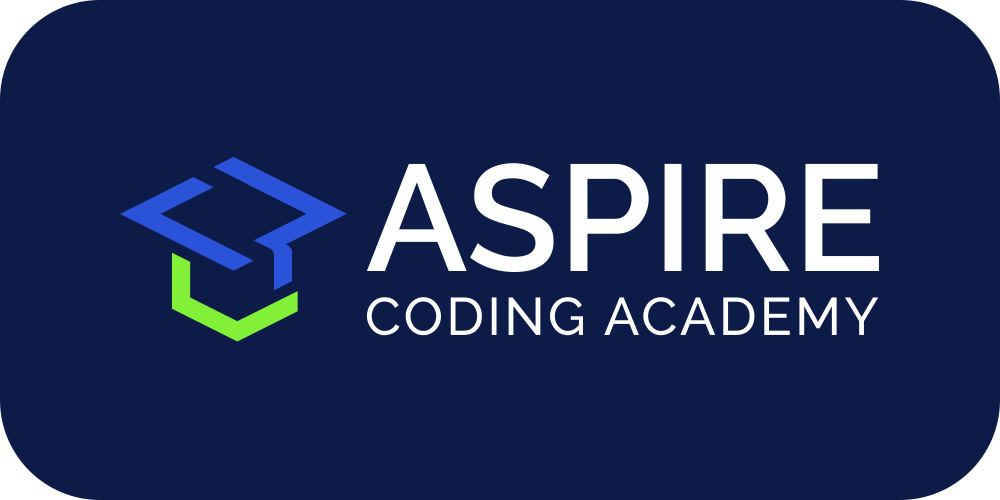

<!-- PROJECT LOGO -->
 

  
   
  <h1 align="center">remote-development-intro</h1>

  
Not to be confused with remote work, or remote controls

<!-- TABLE OF CONTENTS -->

  
Table of Contents

  <ol>
    <li><a href="#about">About</a></li>
    <li><a href="#prerequisites">Prerequisites</a></li>
    <li><a href="#getting-started">Getting Started</a></li>
    <li><a href="#built-with">Built With</a></li>
    <li><a href="#contributing">Contributing</a></li>
    <li><a href="#license">License</a></li>
    <li><a href="#contact">Contact</a></li>
    <li><a href="#acknowledgments">Acknowledgments</a></li>
  </ol>

## About

This repository is part of [Aspire Coding Academy][aca-url]'s `Dream Library`. The `Dream Library` is a collection of open source content meant for use by educators and students alike. The `Dream Library` is licensed under the MIT License.

Remote development is the practice of writing and running code on a separate machine rather than your local computer. Not to be confused with "Remote Work", which refers to working outside of a traditional office. Most software companies use remote development, even if the actual position is not remote.

## Prerequisites

-   Internet Connection

This series starts from step 0. It will guide you from creating a GitHub account, to writing your first program in a GitHub Codespace.

## Getting Started

Follow the chapters in sequence under [`src`](src). Each chapter contains a file named `CHAPTER[X].md` with instructions.

## Built With

[![Markdown][markdown-shield]][markdown-url]

## Contributing

Thank you for your interest in contributing to this project. Open source projects are a beautiful picture of collaboration and generosity. Please raise items for discussion using the links below, via a pull request, or by email.

[Request Feature][feature-request-url] 
[Report Bug][bug-report-url]

## License

[![License][license-shield]][license-url]

## Contact

[contact@aspirecodingacademy.com](mailto:contact@aspirecodingacademy.com)

## Acknowledgments

-   [othneildrew/Best-README-Template][readme-template-url]
    -   For the README template

<!-- MARKDOWN LINKS -->
<!-- https://www.markdownguide.org/basic-syntax/#reference-style-links -->

<!-- repo -->

[feature-request-url]: https://github.com/aspirecodingacademy/remote-development-intro/issues/new?labels=enhancement&template=feature-request---.md
[bug-report-url]: https://github.com/aspirecodingacademy/remote-development-intro/issues/new?labels=bug&template=bug-report---.md

<!-- about -->

[product-screenshot]: readme-assets/screenshot.png

<!-- usage -->

[usage-screenshot]: readme-assets/screenshot.png

<!-- built_with -->

[python-shield]: https://img.shields.io/badge/python-3670A0?style=for-the-badge&logo=python&logoColor=ffdd54
[python-url]: https://python.org/
[react-shield]: https://img.shields.io/badge/React-20232A?style=for-the-badge&logo=react&logoColor=61DAFB
[react-url]: https://reactjs.org/
[markdown-shield]: https://img.shields.io/badge/markdown-%23000000.svg?style=for-the-badge&logo=markdown&logoColor=white
[markdown-url]: https://www.markdownguide.org/

<!-- license -->

[license-shield]: https://img.shields.io/github/license/aspirecodingacademy/blog.svg?style=for-the-badge
[license-url]: https://github.com/aspirecodingacademy/remote-development-intro/blob/master/LICENSE.txt

<!-- acknowledgements -->

[readme-template-url]: https://github.com/othneildrew/Best-README-Template
[aca-url]: https://aspirecodingacademy.com
