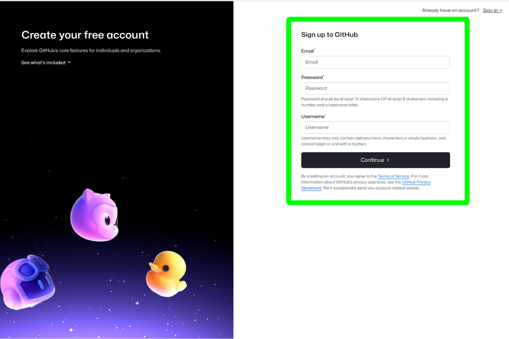
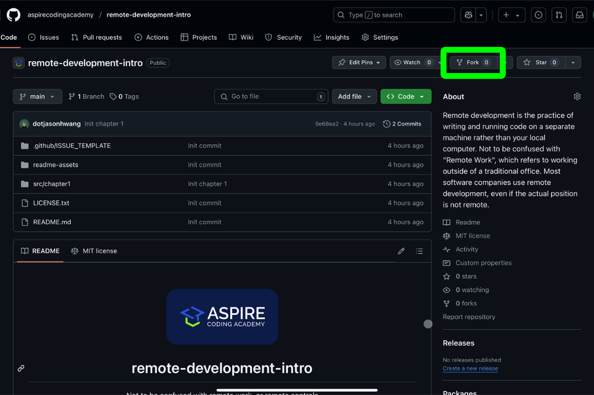
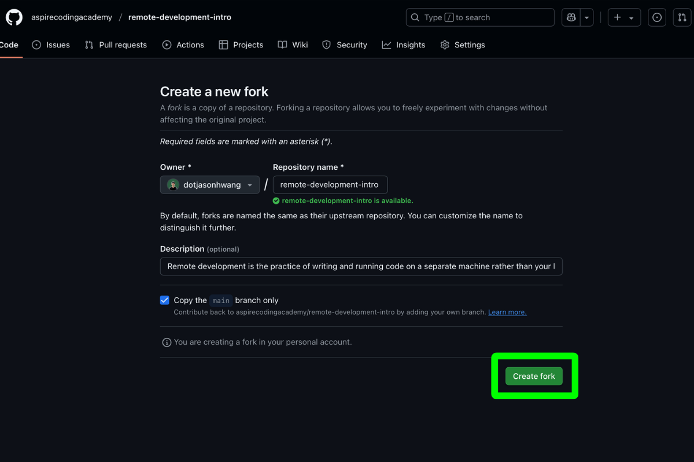
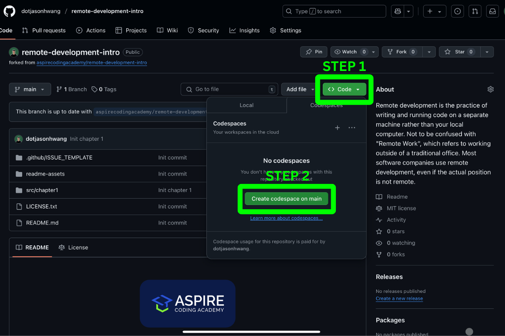
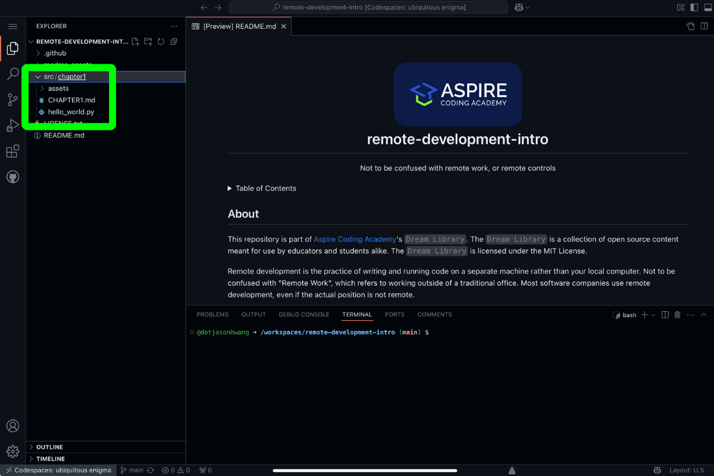
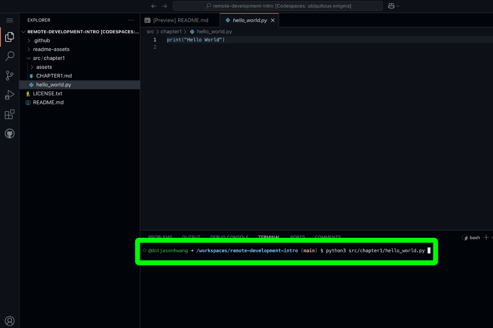
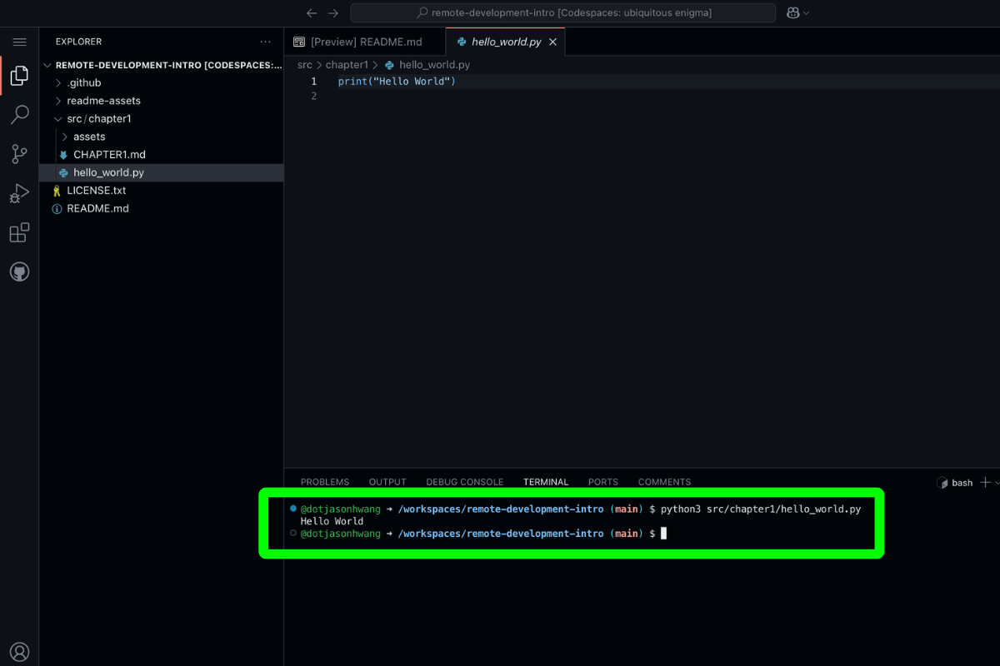
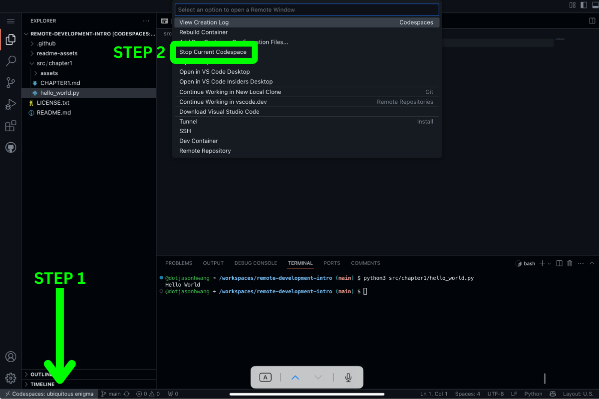
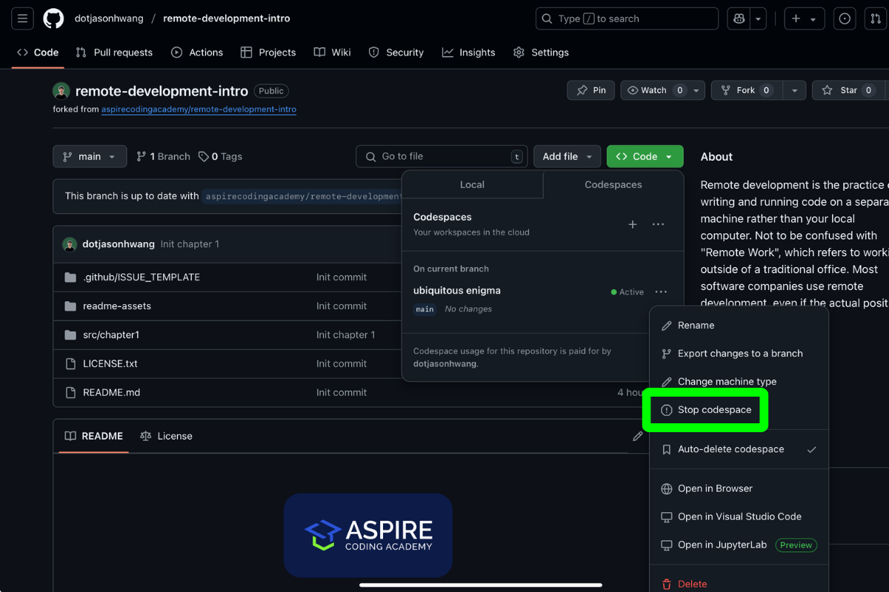

# Remote Development Intro 1: Set Up

Welcome to Chapter 1 of ACA’s Remote Development Intro. By the end of this series, you'll have a working GitHub Codespace with a functional Python program. This chapter covers setup. If you're new to remote development, check out [our previous blog](https://aspirecodingacademy.com/blog/remote-development/) for an introduction. No prior experience is required—this guide is for beginners.

[Next Chapter](https://aspirecodingacademy.com/blog/remote-development-intro-2/)

## Goal

Create a GitHub account, clone a repository, and start a GitHub Codespace.

## Notes

Follow each step carefully. Under each, I'll define key terms. FYI, I’m a dark mode snob 🌒, hence the dark-themed screenshots.

## Chapter 1: Setup

### 1: Create Your GitHub Account

**Definitions:**

-   **GitHub:** A web-based platform for managing Git repositories.
-   **Git:** A distributed version control system for tracking changes in source code during software development.
-   **Version Control System:** A tool that tracks changes in code, allowing collaboration and edit history preservation.

If you already have a GitHub account, skip this step.

[Create your GitHub account](https://docs.github.com/en/get-started/start-your-journey/creating-an-account-on-github). For this chapter, a free GitHub plan is sufficient. Changing your username is possible but tedious, so I recommend spending a few minutes on choosing a suitable username. [See this discussion](https://github.com/orgs/community/discussions/39082) for guidance.



### 2: Fork the [remote-development-intro](https://github.com/aspirecodingacademy/remote-development-intro) Repository

**Definitions:**

-   **Repository:** A project folder containing code, files, and version history.
-   **Forking:** Copying an existing repository to your own account, allowing you to modify it independently. It’s like duplicating a Google Doc—except you can also suggest changes to the original repository (not needed for this chapter).



Then



### 3: Create Your Codespace

**Definitions:**

-   **Codespace:** A cloud-based development environment powered by GitHub, accessible via a browser or Visual Studio Code.
-   **Main:** The default branch in a Git repository, typically containing the latest stable version of the code.

To create a Codespace, click **Code** → **Create Codespace on main**.



### 4: Confirm Your Codespace is Running in Visual Studio Code for Web

**Definitions:**

-   **Visual Studio Code (VS Code):** A code editor by Microsoft.
-   **Visual Studio Code for Web:** A browser-based version of VS Code, allowing remote development without installing software.

Once your Codespace starts, ensure it loads correctly in VS Code for Web.



Open the `hello_world.py` file under the `chapter` folder to see its contents. In Python, `print` is a function that displays the contents.

### 5: Run This Command in your Terminal

**Definitions:**

-   **Terminal:** a text-based user interface where you can type commands to interact with your computer and run programs.
-   **Command:** an instruction given to the computer.

In your terminal, type this command and press enter.

```
python3 src/chapter1/hello_world.py
```



This runs the Python program inside your Codespace.



### 6: Close Your Codespace

To close your Codespace, click the Codespaces button on the bottom left → Stop Current Codespace.



Alternatively, go to the Codespaces tab on GitHub and stop the session.



## Done ✅

That’s it! You now have a remote development environment on your GitHub account. You can start and stop your Codespace anytime—just note that free accounts have limited usage per month. In the next chapter, we’ll make our first code change and learn how to save it using Git.

## Questions?

If you run into issues, contact us at contact@aspirecodingacademy.com. We’re happy to help. Follow us on [LinkedIn](https://www.linkedin.com/company/aspire-coding-academy/) for updates on new blog posts.
