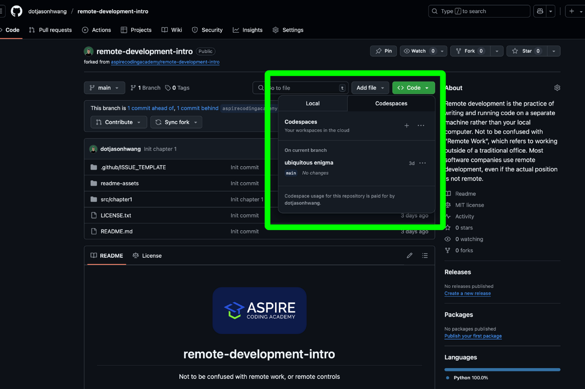
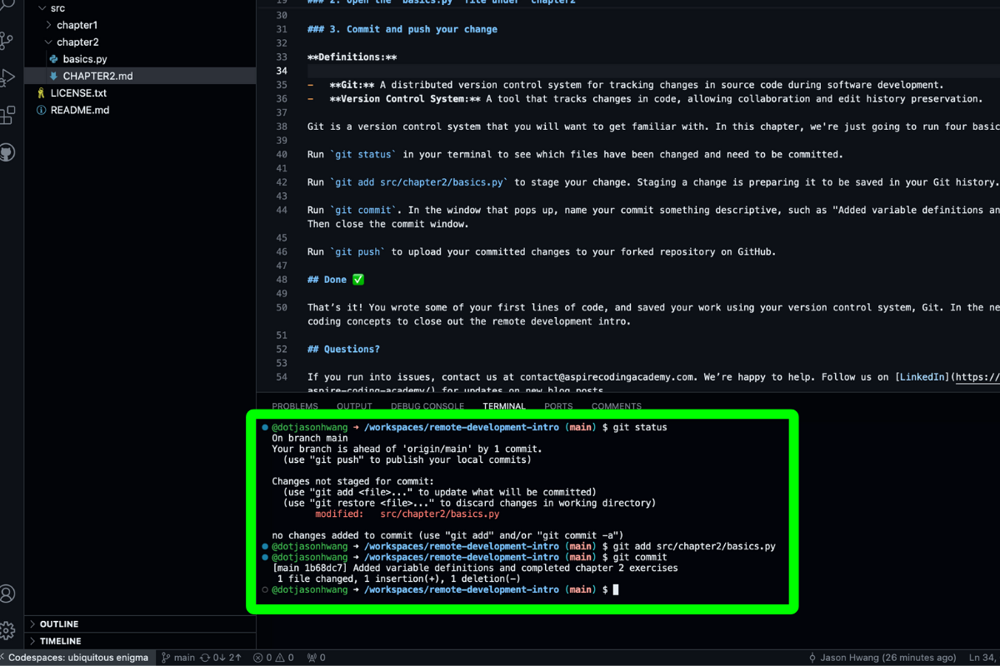
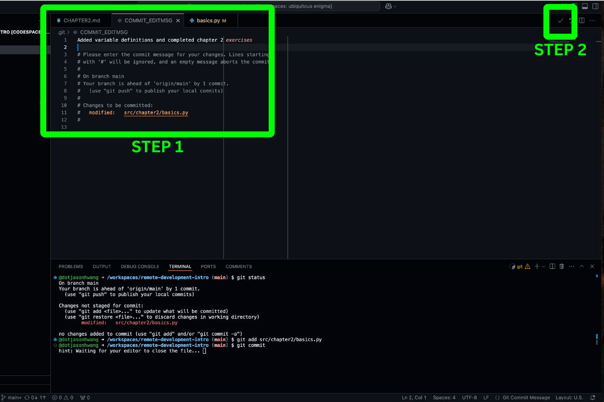
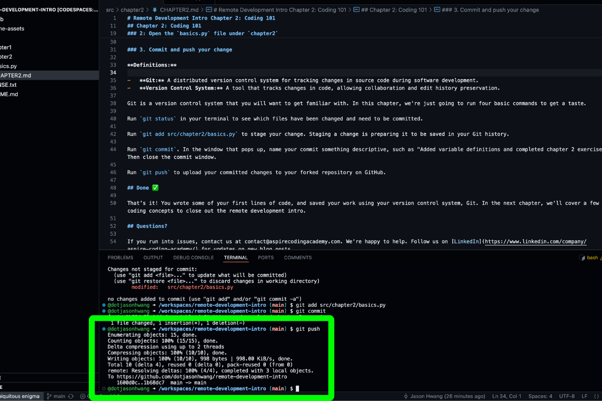

# Remote Development Intro Chapter 2: Coding 101

It’s time to write some code. In this chapter we’re getting a taste of the coding workflow. Remote development is cool but it gets limited pretty quick if all you can do is work in a sandbox, which is not the goal of this series. But before getting to the meat of things we need to cover a few 101s.

[⬅️ Previous Chapter](../chapter1/CHAPTER1.md) | [➡️ Next Chapter](../chapter3/CHAPTER3.md)

## Goal

Make a change in your codespace, and save your work with a Git commit.

## Chapter 2: Coding 101

### 1: Open your codespace

On the forked repository from [Chapter 1](https://aspirecodingacademy.com/blog/remote-development-intro-1/), open or re-open your codespace.

### 2: Open the `basics.py` file under `chapter2`

**Definitions:**

-   **Comment:** A line in code that is ignored by the computer, used to give the human reader more information (starts with `#` in Python)
-   **Variable:** A named container that stores data (like numbers, text, etc.) for later use in the program
-   **STRING:** A sequence of characters (text) enclosed in quotes (e.g., "Hello World")
-   **ARGUMENT:** A value passed to a function when calling it (e.g., in `print("Hi")`, `"Hi"` is the argument)
-   **FUNCTION:** A reusable block of code that performs a specific task (e.g., `print` displays output)

Read through all of the comments on the file and follow the instructions.

### 3. Commit and push your change

**Definitions:**

-   **Git:** A distributed version control system for tracking changes in source code during software development.
-   **Version Control System:** A tool that tracks changes in code, allowing collaboration and edit history preservation.

Git is a very important tool to learn in programming. Let's run 4 Git commands to get started.

Run `git status` in your terminal to see which files have been changed and need to be committed.

Run `git add src/chapter2/basics.py` to stage your change. Staging a change is preparing it to be saved in your Git history.

Run `git commit`. In the window that pops up, name your commit something descriptive, such as "Added variable definitions and completed chapter 2 exercises". Then close the commit window.

Run `git push` to upload your committed changes to your forked repository on GitHub.

## Done ✅

That’s it! You wrote some of your first lines of code, and saved your work using your version control system, Git. In the next chapter, we'll cover a few more coding concepts to close out the remote development intro.

## Questions?

If you run into issues, contact us at contact@aspirecodingacademy.com. We’re happy to help. Follow us on [LinkedIn](https://www.linkedin.com/company/aspire-coding-academy/) for updates on new blog posts.
